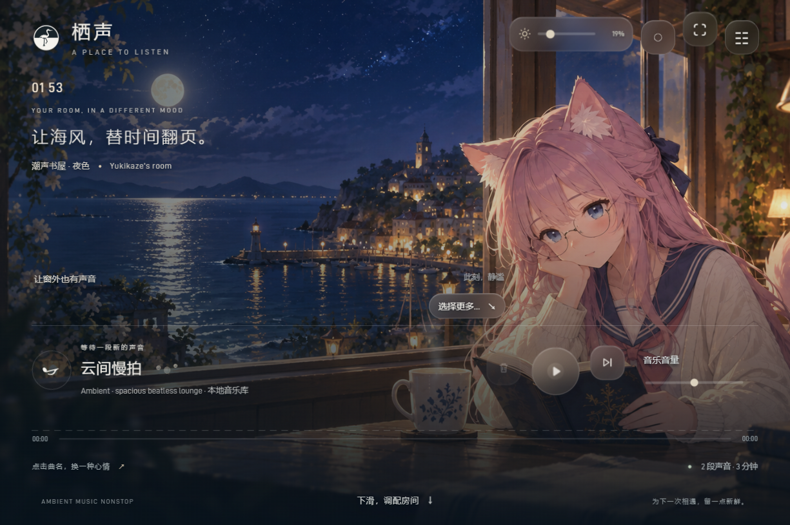
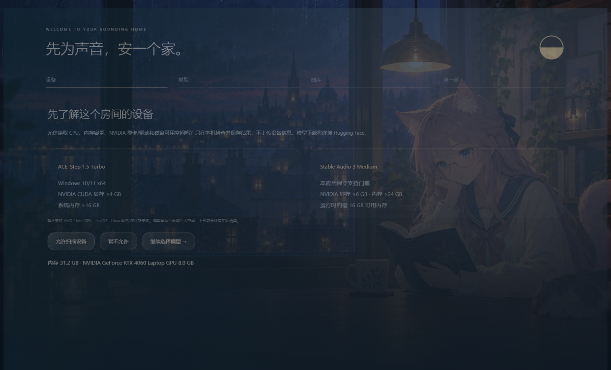
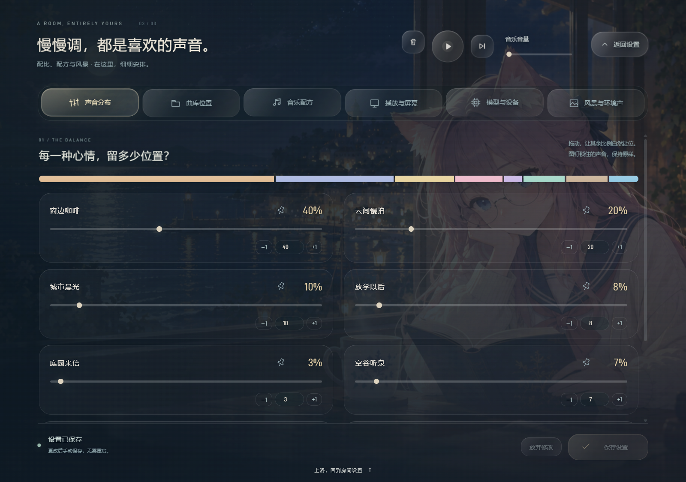
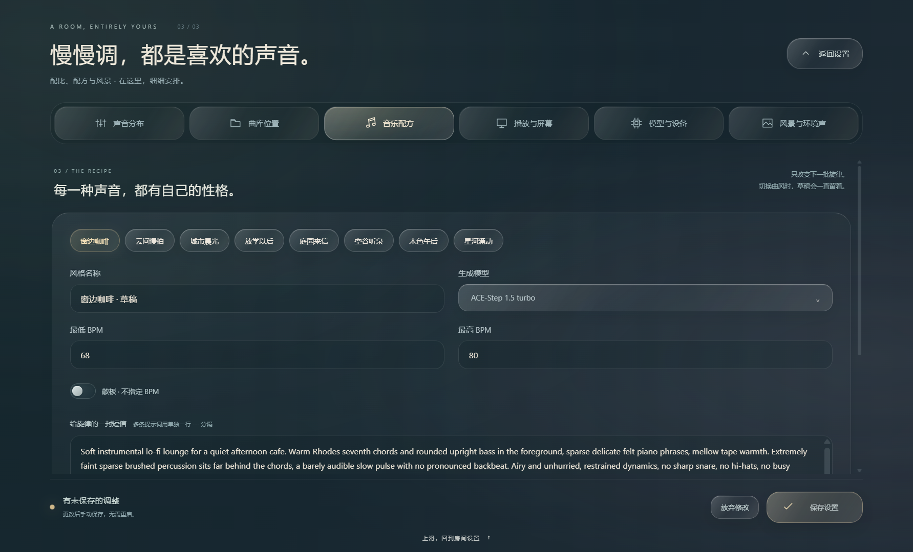

<div align="center">


# 栖声 · Ambient Music Nonstop

**让房间拥有自然变化的声音。**

本地 AI 音乐生成 · 持续轮转的私人曲库 · 环境声混合 · 会呼吸的窗边风景

Windows x64 · Electron + Python · ACE-Step 1.5 / Stable Audio 3 Medium

</div>



栖声先在后台生成音乐，经过检查、响度处理和重复筛选后进入本地曲库。播放器从库存取用音乐，播放到设定次数后自动退休、补充。目标是让音乐成为生活空间的一部分。

## 在房间里

- **本地生成**：按曲风使用 ACE Turbo、ACE SFT 或 SA3 Medium；任务失败有原因记录，CUDA OOM 有恢复与回退流程。
- **八种默认声音**：窗边咖啡、云间慢拍、城市晨光、放学以后、庭园来信、空谷听泉、木色午后、星河涌动。支持编辑或新增配方。
- **会更新的曲库**：按可播放曲目数量分配库存；容量默认 10 GB，完整播放四次后退休，可在高级设置调整。
- **环境声叠加**：雨、海、森林、火炉、列车等独立音量；支持导入 2 秒至 3 分钟的录音、名称与图标；关闭声音层后释放解码缓存。
- **窗边风景**：36 张内置插画随曲风、环境声和时间变化。支持导入图片、指定关联和主体裁切焦点。
- **桌面体验**：鼠标牵引的玻璃控件、呼吸浮动、频谱与光影；同一组播放器随页面移动，设置中常驻右上角。内置 D-DIN 字体，双击非控件区域全屏。支持 WMI 的 Windows 内置屏幕可调亮度。

## 第一次打开



1. 解压完整桌面包，运行 `Ambient Music Nonstop.exe`。不要只拷走 EXE。
2. 如果没有运行环境，先允许设备检查并安装 Python / 推理依赖。此阶段另需约 10–15 GB，建议预留至少 25 GB；依赖损坏时会进入同一修复流程。
3. 在首次向导中同意设备扫描，选择模型及其保存位置。设备结果只存本机。
4. 选择音乐保存目录、启用的曲风和各自百分比。
5. 下载/校验完成后生成第一首音乐。只有通过正式质检入库后，才允许进入播放器，并开启自动补库；此后可主动暂停。

模型下载提供字节进度、剩余时间估计和续传。授权、网络或首曲生成失败时会显示原因，可重试；不会用空播放器跳过首次设置。

1.0.1 的安装与模型向导默认显示当前阶段的一句话总览，可选择 **展开日志** 查看分层记录。工具与源码下载显示真实文件字节进度；依赖安装显示已完成包与步骤，暂时无法计量的解压/检查不会伪造百分比。首次设置有约 1 秒的入场动画，仅在同一桌面配置下播放一次。详见 [1.0.1 发布说明](docs/RELEASE_NOTES_1.0.1.md)。

### 当前支持范围

| 方案 | 系统内存 | NVIDIA 显存 | 说明 |
| --- | --- | --- | --- |
| ACE-Step 1.5 Turbo | ≥16 GB | ≥4 GB | 最小方案；空谷听泉不可用 |
| Stable Audio 3 Medium | ≥24 GB | ≥6 GB | 本应用的保守支持门槛；推理时约需 16 GB 可用内存 |

目前只开放 **Windows 10/11 x64 + NVIDIA CUDA 设备 0** 的首次安装。保持显卡驱动更新。AMD / Intel GPU、macOS、Linux、纯 CPU 新安装和外接显示器 DDC/CI 暂未纳入本应用支持范围。

这些是本应用适配的门槛，不是上游模型的理论最低要求。模型与运行环境的空间不计入音乐池；下载前按实际文件清单检查，并保留 20 GB 磁盘余量。

### Stable Audio 3 授权

在 [SA3 Medium 模型页面](https://huggingface.co/stabilityai/stable-audio-3-medium)登录 Hugging Face，阅读并接受对应条款、获得模型访问权限，再使用有该仓库读取权限的 Token，或本机已有的 HF 登录。**登录 HF 不等于已经获得模型授权。**

向导里的 Token 只用于本次下载，不保存在应用 JSON 配置中。也可以选择已有模型的总目录，校验后启用；“仅校验已有模型”仍需联网读取固定 revision 清单及相应访问权限。总目录结构如下：

```text
models/
  ace-step/checkpoints/    # Turbo、可选 SFT、文本编码器与 VAE
  stable-audio-3-medium/   # 可选 SA3 及 T5Gemma
  clap/                   # 相似度与语义筛查
```

未满足设备、授权或文件要求时，不能启用 SA3。仅使用 ACE 的初始方案会禁用空谷听泉，并让其余已选风格使用 Turbo。

## 把声音调成喜欢的样子

从首页下滑进入设置，再继续下滑进入 **高级设置**；也可以点击放大的高级设置按钮。上滑逐层返回。


播放控件在换页时缓缓移至右上角，各自保留玻璃质感。鼠标可以轻轻牵引按钮；高级设置标签像泡泡一样压下、回弹。两个设置页共享同一扇窗景。



拖动一项百分比，其余未固定的项目按当前比例共同增减，总和保持 100%。图钉固定一项，`−1 / +1` 微调。例：50/25/25 改第三项为 35，会成为 **43/22/35**；固定第一项，则成为 **50/15/35**。首次向导也使用相同算法。

高级设置统一使用底部的 **保存设置**：切换标签、修改配方、调整配比与容量都先保留在草稿中。返回或关闭窗口时若有修改，会先回弹并询问保存、放弃或继续编辑。保存后无需重启；生成中的配方暂不覆盖，草稿保留到队列完成。

首页右上角有常驻亮度滑杆，拖动直接生效。高级设置中的亮度可以即时预览，放弃修改会恢复进入编辑时的亮度，两处同步真实背光。模型下载、设备扫描和曲库迁移是单独按钮触发的操作，页面明确标注。素材导入先进入待保存列表。



配方可编辑名称、模型、BPM 与多条提示词；完整 JSON 提供配器、情绪、调性、拍号、编码和头尾/动态保留等配置。保存只影响新生成任务。模型内部采样参数保持已验证的固定配置，界面会明确说明。

自动调性与 CLAP 筛查是辅助工具，不能证明音乐一定悦耳、配器正确或乐句连贯。提示词过长、文件损坏、明显静音、削波和重复等失败都会记录到工作日志。

## 文件属于自己的电脑

```text
应用数据目录/
  config.json             # 独立用户配置，无 HF Token
  library.sqlite3         # 库存、播放次数、任务与日志索引
  .log/                   # 运行日志
  staging/                # 当前生成工作区
  models/                 # 可指定其他位置
  Images/                 # 用户图片，位置可选
  CustomAmbience/          # 用户环境录音，位置可选
  MusicLib/               # 音乐和逐首 JSON，位置可选
```

新安装使用 Electron 用户目录下的 `data`。已有本机旧库会被接纳，保留路径、曲风、配比、素材和补库开关，跳过首次向导。

发行版运行环境位于当前数据目录的 `runtime`；1.0.1 不再沿用旧 `runtime-location.json` 中的开发目录指针。升级后可能需要重新准备独立依赖，但不会因此重下已配置的模型或改动曲库。安装路径可在准备窗口展开查看。

移动曲库请用高级设置的迁移功能：暂停播放与操作 → 复制 → 逐文件校验 → 切换地址 → 清理已验证的旧文件。**不要直接修改 JSON 里的曲库地址来搬家。** 修改图片/环境声的保存目录只影响未来导入，已导入素材仍使用原注册位置。

## 从源码运行

需要 Node.js 22+ / npm。运行环境安装脚本会下载并核验固定版本 uv 和 FFmpeg，再创建固定版本的隔离 Python 环境；音乐模型由应用向导下载。

```powershell
npm ci
powershell.exe -NoProfile -NonInteractive -ExecutionPolicy Bypass -File scripts/install-runtime.ps1
npm start
```

```powershell
# 单元与算法验证
tools/uv/uv.exe pip install --python vendor/ACE-Step-1.5/.venv/Scripts/python.exe pytest
vendor/ACE-Step-1.5/.venv/Scripts/python.exe -m pytest -q
npm run test:mix
npm run test:release

# 桌面包：运行环境和模型不会塞进包里
npm run package
```

`AMBIENT_DATA_DIR` 可指定隔离数据目录；`AMBIENT_USER_DATA` 可隔离桌面偏好。`AMBIENT_NO_WORKER=1` 仅供测试，禁用生成后不能完成全新的首曲向导。

## 发布与贡献

本开发目录包含历史实验。准备 GitHub 发布时使用 `npm run export:github` 生成允许清单限定的公开源码树，**不要直接把历史开发目录整体上传**。公开树排除个人曲库、试听、模型、凭证、日志、本机配置及私人参考音乐的 embedding。

v1.0 的工程验证与人工验收应分别记录；干净 Windows/NVIDIA 安装不得用开发机结果替代。恢复、备份及升级见 [操作说明](docs/RECOVERY_AND_UPGRADE.md)，完整人工步骤见 [干净系统验收](docs/CLEAN_WINDOWS_ACCEPTANCE.md)。历史界面说明见 [首次设置说明](docs/SETTINGS_V11.md)、[高级设置与亮度修复](docs/SETTINGS_V12.md)、[玻璃动效与字体](docs/ROOM_V13.md) 与 [发布检查](docs/PUBLIC_RELEASE_CHECKLIST.md)。

## 致谢与许可

音频可视化的思路参考 [LyciaMusic](https://github.com/Billy636/LyciaMusic)，本项目以 Web Audio 实现。音乐模型来自 [ACE-Step](https://github.com/ace-step/ACE-Step-1.5) 与 [Stable Audio 3](https://github.com/Stability-AI/stable-audio-3)。

应用源码采用 [AGPL-3.0](LICENSE)。模型权重、环境录音与依赖各自保留原许可证，应用源码许可不替代模型条款。录音来源见 [素材清单](builtin-ambience/manifest.json)，其余见 [第三方说明](THIRD_PARTY_NOTICES.md)。
